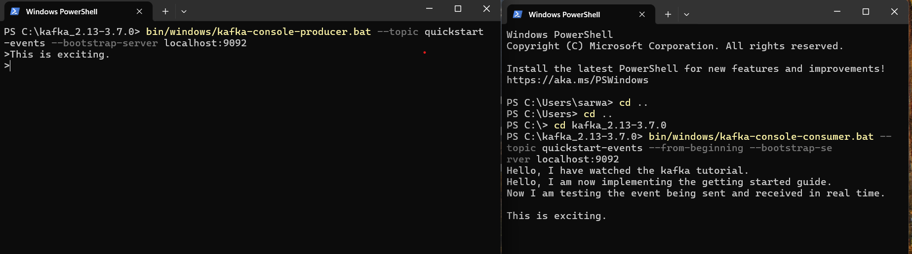

# Real Time Data Ingestion Kafka

A beginner-level project demonstrating real-time data ingestion using Apache Kafka. 
This project includes a producer script to send messages to a Kafka topic and a consumer script to read messages from the topic,
all implemented in Python.

## What is Apache Kafka?

Apache kafka is a distributed event streaming platform that 
stores ordered sequence of events in logs often called topics. It lets you read, write,
store and process events across many machines. A kafka client communicates with the kafka
brokers via the network for writing or reading the events and brokers stores the events in 
a durable and fault-tolerant manner for as long as needed. Since the events are stored, 
they can be read by as many times and as many consumers as required.

Programs can consume these events, process and generate new 
events in another topic. There is no rule for topics to be small 
or large and topics can hold events for a few hours or hundreds of 
years if required. 

Kafka connect is usually used to be able to integrate with legacy systems. There are a large number of pluggable modules
both open source or commercial which can be deployed to integrate with legacy systems.This 
is done in a declarative way without writing any additional code. You just need 
to configure and deploy them. 

Kafka streams is a java API that can help aggregate, group, join or filter multiple events
without writing extensive code within the programs or services that consumes events from topics. 

## Initial Setup

1. Create a repository on the local computer named "real-time-data-ingestion-kafka" and publish it on Github. 
2. Create a new branch called "feature/init-setup" from the main branch. 
3. Add a README.md to document learnings and steps to complete the project. 
4. This project used PyCharm as an IDE and Anaconda as the distribution for Python.
5. Create a separate conda environment for the project.
   `conda create --name kafka-env python=3.10`
6. Activate the conda environment. 
   `conda activate kafka-env`
7. Check Java version to make sure that 8+ version is installed. Open command prompt and
type `java --version`. It should return a similar message as in the image. 

8. Go to https://www.apache.org/dyn/closer.cgi?path=/kafka/3.7.0/kafka_2.13-3.7.0.tgz, 
download the latest kafka release and extract content.
9. If you are using windows, extract the folder in C: directory. Otherwise, you might face issues in
starting the zookeeper server. 
10. Open window powershell and go to the directory where kafka was extracted. 
`cd C:\kafka_2.13-3.7.0`
11. Run Kafka with zookeeper. Start the Zookeeper service on windows with following command.
`bin/windows/zookeeper-server-start.bat config/zookeeper.properties`
12. Open another powershell terminal, go to the kafka directory in C: drive and start the kafka broker service. 
`bin/windows/kafka-server-start.bat config/server.properties`
13. Now let's create our topic. Open another terminal session, go to the kafka directory in C: drive and run the following command. 
`bin/windows/kafka-topics.bat --create --topic quickstart-events --bootstrap-server localhost:9092`

14. In order to know additional commands to create, delete, describe or change a topic, run the following command. 
`bin/windows/kafka-topics.bat`
15. Now let's write events to our kafka topic using the following command.
 `bin/windows/kafka-console-producer.bat --topic quickstart-events --bootstrap-server localhost:9092`

16. Let's read the events sent and see the real time event reception. Open another terminal and run the following command to receive 
the event. 
`bin/windows/kafka-console-consumer.bat --topic quickstart-events --from-beginning --bootstrap-se
rver localhost:9092`

17. We can list Kafka topics by running the following command. 
`bin/windows/kafka-topics.bat --list --bootstrap-server localhost:9092`

## Producing and Consuming Kafka messages using Python Client
1. Activate conda environment created in the initial setup. 
2. Install Kafka Python client using the following command. 
`pip install kafka-python` 
3. Documentation for kafka-python API is available here: https://kafka-python.readthedocs.io/en/master/apidoc/modules.html
4. producer.py contains a basic code for sending events. The events can be viewed on the console as mentioned in
initial setup. 

5. consumer.py contains a basic code for receiving and listing events. 

